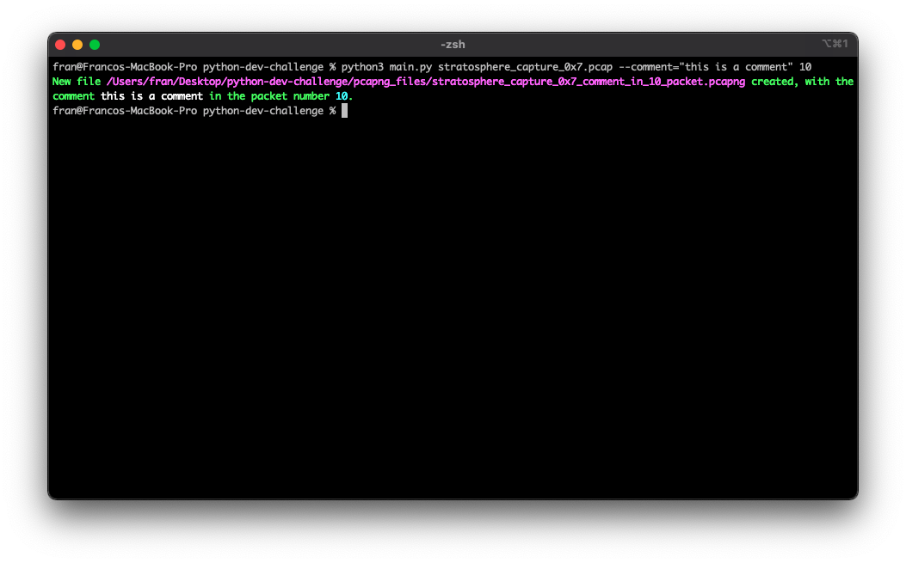
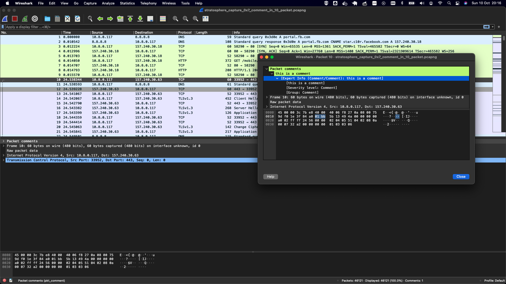
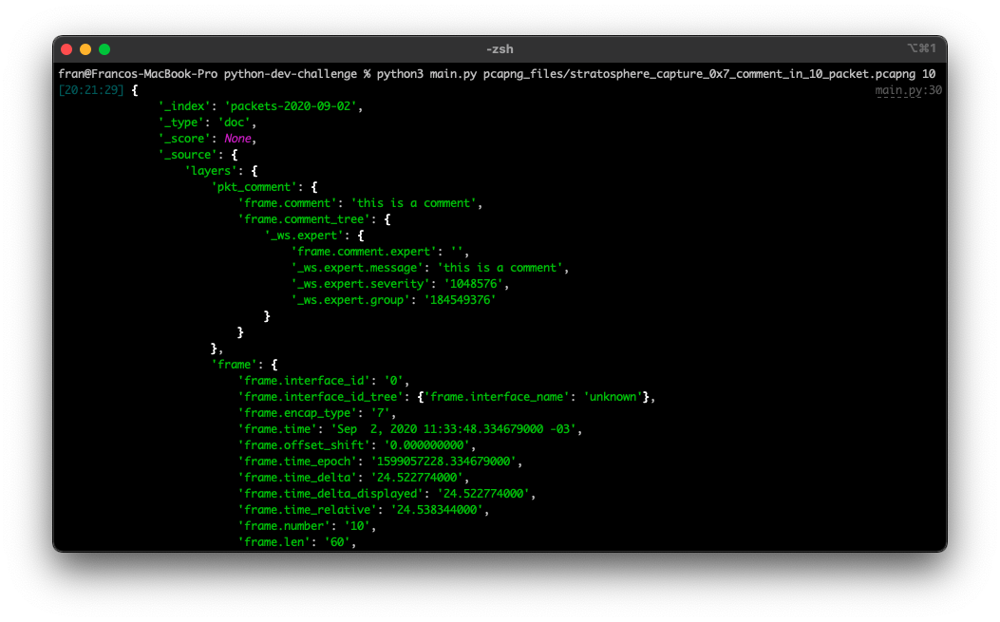
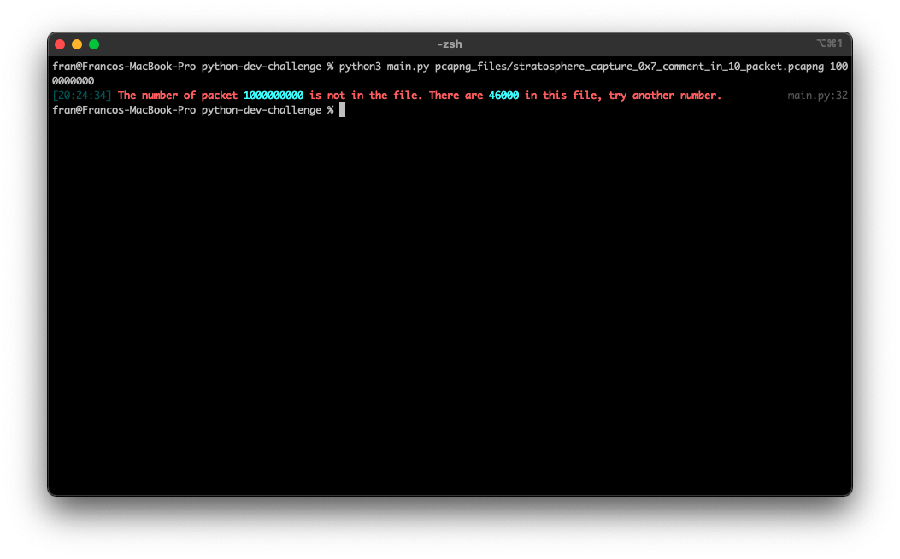

# Python Developer Challenge

This is a challenge where I have to develop a Python program that has two functionalities:

1. **Given three parameters**, a pcapng file, a string of text, and a packet number. It has to output a new pcapng file with the comment inserted in the correct packet.
2. **Given two parameters**, a pcapng file, and a packet number. It has to print the package content in JSON format. 

## Installing
You need to install [Wireshark](https://tshark.dev/setup/install/#install-wireshark-with-a-package-manager) to use it. The program internally uses the _**tshark, capinfos, and editcap**_. \
There is only one dependency: [rich](https://github.com/willmcgugan/rich), it is used for formatting the prints. To install it run: \
```
python3 install -r requirements.txt
```

## First functionality
```
python3 main.py stratosphere_capture_0x7.pcap --comment="this is a comment" 10
```




## Second functionality

```
python3 main.py stratosphere_capture_0x7.pcap --comment="this is a comment" 10
```



## Errors handling
When you put an invalid packet number, it returns an error.

